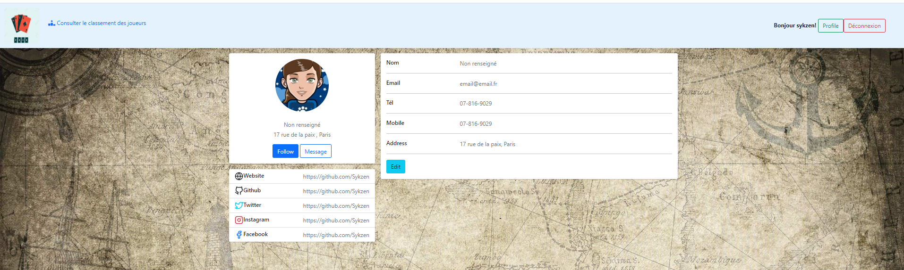

# CardGame

Jeux de Carte de Mémoire multi-joueurs

## KIT


## Display





## Requirements

-Having Xammp,Wammp or any server that support PHP

## Usage

No need database

```
git clone https://github.com/Sykzen/CardGame.git (in your server)
```

Open your browser and go to http://localhost/CardGame/index.php

## Contributors

- [Sykzen](https://github.com/Sykzen)
- [Makduv](https://github.com/Makduv)

## Reference

- https://github.com/robert-upwork/Laravel-MaterialUI-AdminPanel (arborescence)
